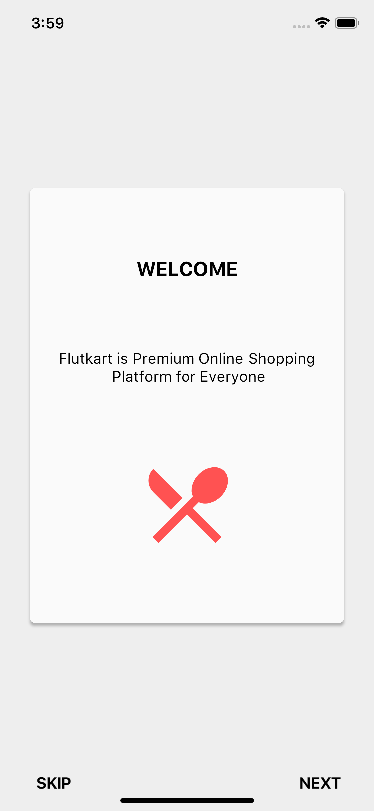
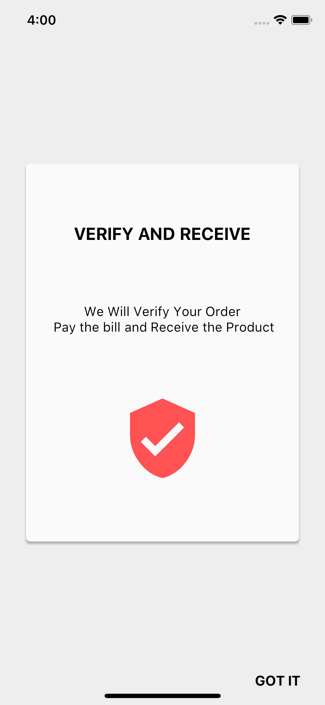

# flutter_intro_screen

A new Flutter package for both android and iOS which helps developers in creating animated walkthrough of their app.

## Screenshots

| page1                          | page2                          |
| ------------------------------- | ------------------------------- |
|  |  |

## Usage

[Example](https://github.com/inamhusain/flutter_intro_screen_plus.git)

To use this package :

```yaml
  dependencies:
    flutter:
      sdk: flutter
    flutter_intro_screen_plus:
```

### How to use

```dart
class TestScreen extends StatelessWidget {
 /*here we have a list of walkthroughs which we want to have, 
  each walkthrough have a title,content and an icon.
  */
  final List<IntroCardWidget> list = [
    const IntroCardWidget(
      title: "Title 1",
      content: "Content 1",
      imageIcon: Icons.restaurant_menu,
    ),
    const IntroCardWidget(
      title: "Title 2",
      content: "Content 2",
      imageIcon: Icons.search,
    ),
    const IntroCardWidget(
      title: "Title 3",
      content: "Content 3",
      imageIcon: Icons.shopping_cart,
    ),
    const IntroCardWidget(
      title: "Title 4",
      content: "Content 4",
      imageIcon: Icons.verified_user,
    ),
  ];

  @override
  Widget build(BuildContext context) {
    return IntroScreen(
      walkthroughList: list,
      pageRoute: MaterialPageRoute(builder: (context) => TestScreen()),
    );
  }
}

```
